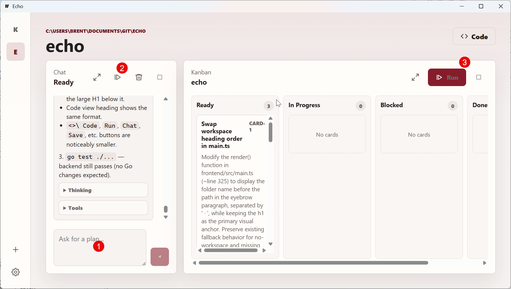
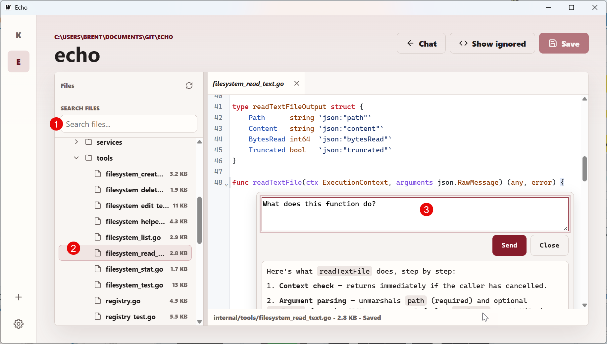

# Echo

Echo is a local-first programmer's AI harness. it's made for serious/actual programmers. It's design is to allow you to work with your AI on creating and modifying program code. You can break down large ideas into Kanban tasks for the AI to execute. You can easily review all code changes, you can even manually write code directly using Echo.

Use local models like Qwen, Gemma, Deepseek, and others; and I only intend to use local models. VS Code sucks hard with local models, it errors and times out all the time. This software fixes that and adds special features that I use for development, like the LLM Kanban board.

## Features
There are 2 primary features that make up Echo. A Kanban board for large tasks and features, and a code editor for fine tuning and working with individual functions and routines. See [the wiki](https://github.com/BrentFarris/echo/wiki) for some tips and the list of hotkeys.

### Kanban
The Kanban view has a chat for you to come up with a plan for implementing a feature. Once the plan in the chat looks good, you just click the decompose chat button to have the LLM break it down into tasks. Tasks will show up in the Kanban view, you can review them and if you like the plan, you can run the Kanban cards.


1. Devise a plan
2. Break the plan down into tasks
3. Have the AI execute the tasks

### Code Editor
Sometimes I just want to look at a function in the code and chat with the AI directly about that line or to implement a specific line. I don't go full vibe code on my projects, I do like to control the direction of my main projects, this helps do that.


1. Search for files
2. File/folder list to find files
3. Inline chat with the selected file (including edits)

## Requirements

- Go 1.24 or newer
- Node.js and npm
- Wails v2 CLI
- An OpenAI-compatible chat completions endpoint

## Run In Development

```powershell
wails dev
```

Echo stores app state in the current user's config directory at `Echo/state.json`. Chat messages, live agent traces, and Kanban cards are kept in memory only and are cleared when the app closes. Settings and workspaces persist between launches.

## Configure

Open Settings from the left gutter and set:

- `Endpoint`: base URL for an OpenAI-compatible API, for example `http://localhost:11434/v1`
- `Model`: model name accepted by the endpoint
- Generation options: temperature, top-k, top-p, context length, max tokens, penalties, and timeout

If the endpoint is offline or invalid, Echo shows a recoverable error in the UI and records the failure in chat or card progress.

## Test

Run backend tests:

```powershell
go test ./...
```

Run the frontend production build:

```powershell
cd frontend
npm run build
```

Run the Wails production build:

```powershell
wails build
```

## Manual Smoke Flow

1. Start Echo and confirm a fresh install opens without existing settings.
2. Save endpoint and model settings.
3. Add a workspace from the left gutter.
4. Ask Echo to inspect or plan work in chat.
5. Execute the visible plan and confirm Ready cards are created.
6. Run Kanban agents and confirm cards move through In Progress and Done, or Blocked with a clear error.
7. Open a card while it runs and confirm progress streams only while the detail view is open.
8. Check light and dark system themes.

## Windows Packaging

Windows assets live under `build/windows`:

- `icon.ico`
- `info.json`
- `wails.exe.manifest`

The app name and output executable are configured in `wails.json`.
