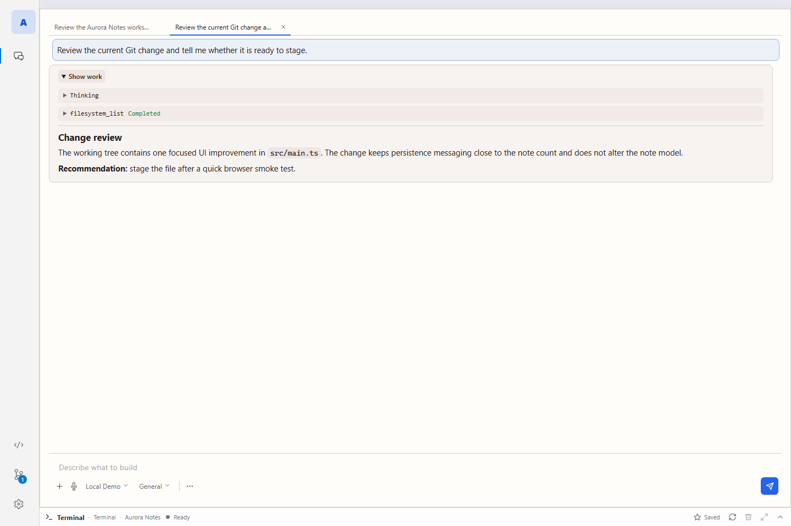
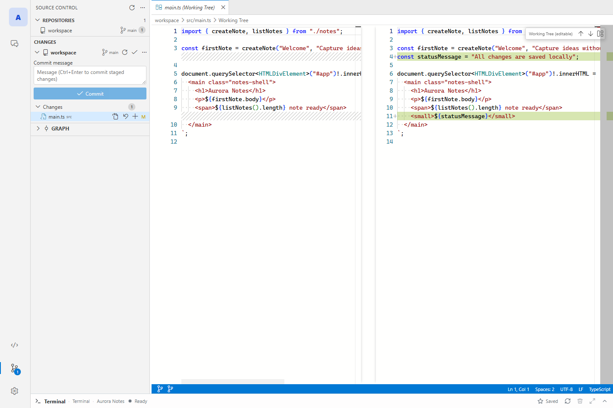

# Echo

<p align="center">
  <strong>A local-first AI coding workspace that runs in your browser.</strong>
</p>

<p align="center">
  <a href="https://github.com/BrentFarris/echo/actions/workflows/nightly-builds.yml"></a>
  <a href="LICENSE"></a>
  
  
</p>

<p align="center">
  <a href="#quick-start">Quick start</a> ·
  <a href="#configure-a-model">Model setup</a> ·
  <a href="#build-from-source">Build from source</a> ·
  <a href="#security">Security</a>
</p>



Echo brings chat, code editing, source control, and terminals together in one responsive web interface. The Go server works directly with folders on its machine, persists each workspace's conversations and agent configuration, and serves the TypeScript application as part of a single binary.

Connect Echo to a local or remote provider that exposes an OpenAI-compatible `/chat/completions` API. Echo supports streamed responses, reasoning content, and tool calls without requiring an Echo account or hosted Echo service.

> **Project status:** Echo is under active development. Nightly builds are unsigned snapshots of the current `master` branch.

## What Echo can do

| Area | Current capabilities |
| --- | --- |
| **Chat** | Persistent workspace conversations, multiple chat tabs, per-chat model and agent-mode selection, streamed Markdown, reasoning, tool activity, stop and clear controls, and skill creation from a conversation |
| **Agent modes** | Built-in General and read-only Plan modes plus workspace-defined system instructions, tool allowlists, and path restrictions |
| **Code** | Monaco editing, file tabs, workspace trees, quick open, text and file search, create/rename/save operations, external-change detection, recoverable trash, and browser hot-exit buffers |
| **Git** | Repository discovery, working-tree status, staged and unstaged diffs, staging, commits, branches, remotes, fetch/pull/push/sync, history, tags, and stashes |
| **Terminal** | Workspace-aware PTY sessions powered by xterm.js, resize, restart, stop, and reusable saved commands |
| **Agent tools** | Workspace-scoped file inspection and editing, shell commands, text and file search, image/video reads, web fetch/search, image generation, and reusable workspace skills |
| **Connections** | Multiple OpenAI-compatible LLM endpoints, custom HTTP headers, interaction routing, optional SearXNG research, and optional ComfyUI image generation |
| **Access** | Owner-password authentication, remembered browser sessions, session revocation, WebSocket updates, and desktop/mobile browser layouts |

### Workspace-scoped agents

Echo gives the selected model tools for the active workspace rather than unrestricted filesystem context. The built-in Plan mode exposes inspection and research tools without mutation tools. Custom modes can change the system instructions, choose exactly which tools are available, and limit path-aware tools with workspace-relative glob patterns.

Reusable skills live in `.echo/skills/` inside a workspace. Echo can search and read them during a chat, record new skills through tool calls, or synthesize a skill from the current conversation.

### Editor, Git, and terminal in one place



The Code view uses Monaco for editing and reviewing diffs. Its explorer watches the filesystem for changes, keeps unsaved browser buffers recoverable, and moves deleted entries into Echo's restorable trash. The source-control view supports common repository workflows without leaving the browser, while the integrated terminal provides a full PTY on the Echo server.

## Quick start

### Download a nightly build

Open [GitHub Releases](https://github.com/BrentFarris/echo/releases) and download the nightly archive for your platform.

| Platform | Release asset |
| --- | --- |
| Windows | `echo-windows-nightly.zip` |
| Linux | `echo-linux-nightly.tar.gz` |
| macOS | `echo-macos-nightly.tar.gz` |

Echo is now a standalone web server. It does not require Wails, WebView2, GTK, or WebKitGTK.

On Windows PowerShell:

```powershell
Expand-Archive .\echo-windows-nightly.zip -DestinationPath .\Echo
.\Echo\echo.exe
```

On Linux or macOS:

```bash
tar -xzf echo-linux-nightly.tar.gz # use echo-macos-nightly.tar.gz on macOS
chmod +x echo
./echo
```

The nightly binaries are not currently code-signed or notarized. Your operating system may ask you to confirm that you trust the downloaded file.

### Complete first-run setup

1. Start Echo and leave its terminal window open. It prints the web address and a one-time authentication setup code.
2. Open [http://localhost:3740](http://localhost:3740) in a modern browser.
3. Enter the setup code, name the browser or device, and choose an owner password between 12 and 128 characters.
4. Open **Settings → LLM Endpoints** and configure a model provider.
5. Add a workspace by giving Echo a name and one or more existing folders on the server machine.
6. Return to Chat, choose a model and agent mode, and ask Echo to inspect or change the workspace.

If the owner password is lost, stop Echo and restart it with `-reset-auth`. This clears the password and all remembered sessions, then prints a new setup code.

## Configure a model

Echo appends `/chat/completions` to the endpoint URL unless it is already present. The provider must accept OpenAI-compatible chat-completion requests and, for interactive chat, streamed server-sent events and OpenAI-style tool calls.

Common local base URLs include:

| Provider | Typical base URL |
| --- | --- |
| Ollama | `http://localhost:11434/v1` |
| LM Studio | `http://localhost:1234/v1` |
| llama.cpp server | `http://localhost:8080/v1` |
| Remote provider | The provider's OpenAI-compatible HTTPS URL |

Each endpoint profile has its own model name, generation settings, timeout, optional system-prompt appendage, and custom headers. Custom headers can carry provider-specific authentication such as `Authorization: Bearer ...`.

Endpoint routing lets Chat, Research, Vision, and Inline Code use different profiles. The model picker in Chat can override the routed Chat model for the next conversation turn.

Optional connections are configured under **Settings → External Connections**:

- A SearXNG URL enables the `web_search` agent tool.
- A ComfyUI URL and workflow files enable text-to-image and image-to-image tool calls.

## Command-line options

```text
-port int
    HTTP port to listen on (default 3740)
-web string
    Serve SPA assets from this directory instead of the embedded production build
-data string
    Use this application-data JSON file instead of the platform config directory
-reset-auth
    Clear the owner password and remembered sessions and issue a new setup code
```

Echo listens on the selected port, including non-loopback interfaces. Control network access with the host firewall or a reverse proxy.

## Build from source

### Requirements

- Go 1.26 or newer
- Node.js 22 and npm
- Git
- A modern browser

Clone the repository, build the frontend, and then compile the Go server so the production assets are embedded in the executable:

```bash
git clone https://github.com/BrentFarris/echo.git
cd echo/web
npm ci
npm run build
cd ..
go build -trimpath -o build/echo .
./build/echo
```

On Windows, use `go build -trimpath -o build/echo.exe .` and run `.\build\echo.exe`.

### Development

Run the backend and Vite development server in separate terminals.

Terminal 1, from the repository root:

```bash
go run .
```

Terminal 2:

```bash
cd web
npm ci
npm run dev
```

Open [http://localhost:5173](http://localhost:5173). Vite proxies `/api` and `/ws` to the Go server on port 3740.

### Tests

Run the Go and frontend suites:

```bash
go test ./...
cd web
npm test
npm run build
```

The authenticated browser acceptance tests use Playwright and build an isolated Echo runtime:

```bash
cd web
npx playwright install chromium
npm run test:e2e
```

## Architecture

| Layer | Implementation |
| --- | --- |
| **Host** | Go HTTP server with JSON endpoints, authenticated WebSockets, embedded production assets, and graceful shutdown |
| **Frontend** | Frameworkless TypeScript and Vite, with Monaco for editing and diffs and xterm.js for PTY terminals |
| **LLM** | OpenAI-compatible chat-completions client with streaming, reasoning, tool-call orchestration, model routing, and configurable headers |
| **Workspace services** | Path-scoped filesystem operations, indexed search, file watching, recoverable trash, Git, terminals, custom agent modes, and skills |
| **Persistence** | Atomic JSON stores for global configuration and workspace-owned state |

The same SPA is served in production from the Go binary. During development, Vite serves the frontend and proxies API and WebSocket traffic to the backend.

## Data and storage

Echo's global data is stored in `Echo/echo.json` under the current user's platform configuration directory. It contains settings, endpoint profiles, registered workspaces, authentication records, and saved terminal commands. Use `-data` to choose a different file for testing or isolated installations.

The main folder of each workspace owns a `.echo/` directory. Current workspace files include:

```text
.echo/
├── workspace.json
├── chat-workspace.json
├── agent-modes.json
└── skills/
    └── <skill-name>/SKILL.md
```

Echo writes these files atomically. Deleted workspace entries are moved to a separate trash store beside the global data file so they can be restored from the Code view. Browser hot-exit state is local to that browser and is cleared when signing out.

## Security

Echo is a single-owner development tool, not a multi-tenant service.

- The first process start prints a memory-only setup code. Completing setup creates an Argon2id-protected owner password.
- Browser sessions are remembered, expire over time, and can be reviewed or revoked under **Settings → Security**.
- Authentication controls access but does not encrypt plain HTTP. Use Echo only on a trusted network unless a TLS reverse proxy protects the connection.
- Every authenticated device can edit workspace files, run Git operations, and execute arbitrary commands through terminals and enabled agent tools.
- Agent modes reduce what is offered to a model, but the General mode is intentionally powerful. Use trusted models, keep work in version control, and expose only the folders Echo needs.
- Custom endpoint headers may contain secrets and are stored in the local application-data file. Protect that file with the same care as other developer credentials.

## Contributing

Issues and focused pull requests are welcome. Keep backend and frontend changes covered by their respective tests, run the production frontend build before compiling a distributable binary, and include Playwright coverage for important authenticated browser workflows.

Echo is available under the [MIT License](LICENSE).
