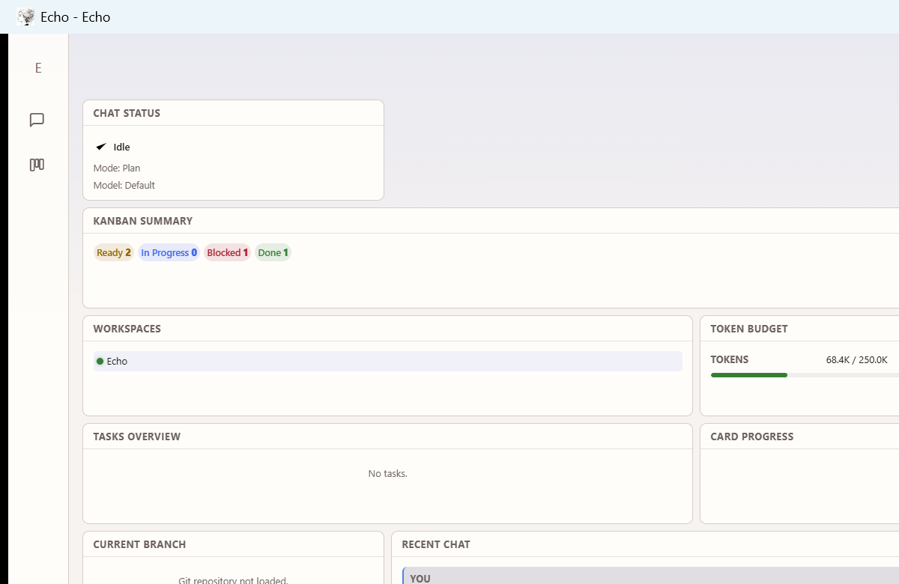
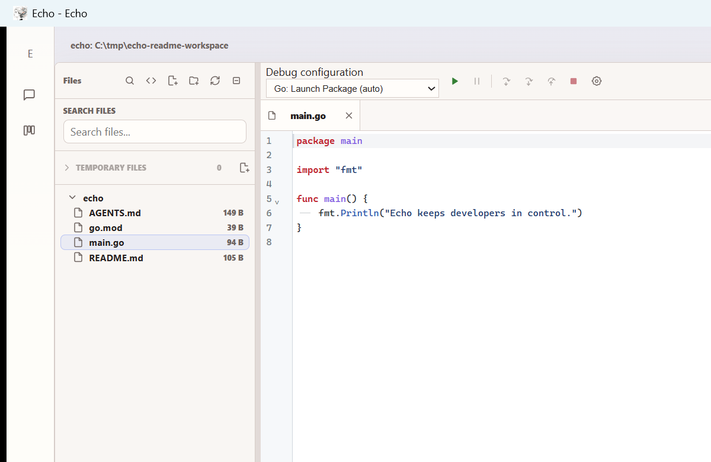

# Echo

<p align="center">
  <strong>A local-first AI workbench for planning, implementing, reviewing, and verifying software changes.</strong>
</p>

<p align="center">
  <a href="https://github.com/BrentFarris/echo/actions/workflows/nightly-builds.yml"></a>
  <a href="LICENSE"></a>
  
  
  
</p>

<p align="center">
  <a href="#install-echo">Install Echo</a> ·
  <a href="#what-echo-can-do">Features</a> ·
  <a href="#configure-a-model">Model setup</a> ·
  <a href="https://github.com/BrentFarris/echo/wiki">Wiki</a>
</p>



Echo keeps the whole development loop in one desktop application: talk through a change, turn the plan into dependent Kanban cards, let workspace-scoped agents execute it, inspect every file change, edit code directly, run tests, and commit the result.

It works with local or remote providers that expose an OpenAI-compatible `/chat/completions` API. Ollama, LM Studio, llama.cpp, vLLM, and other compatible servers can all be used without an Echo account or hosted Echo backend.

## What Echo can do

| Area | Capabilities |
| --- | --- |
| **Chat** | Multi-tab conversations, Ask/Plan workflows, streamed reasoning and tool activity, retry/edit/prune controls, file mentions, and image or video attachments |
| **Backlog** | Persistent tasks with priorities, epics, tags, acceptance criteria, file references, filters, and conversion into executable Kanban work |
| **Kanban** | Plan decomposition, dependency-aware cards, concurrent agents, progress transcripts, per-card direction, retries, liveness checks, watchdog verification, and automated repair |
| **Code** | File explorer, quick open, workspace search, CodeMirror editing, inline AI edits, tabs, media previews, and LSP-powered navigation |
| **Debug** | DAP-compatible launch configurations, breakpoints, threads, stack frames, scopes, variables, expression evaluation, and step controls |
| **Git** | Clone, inspect diffs, stage/unstage, commit, create or switch branches, merge, sync, inspect stashes and commits, and discard selected changes |
| **Terminal** | Integrated PTY terminals, concurrent command runs, saved commands, and workspace-aware execution |
| **Dashboard** | Customizable widgets for agent activity, Kanban progress, workspaces, token budgets, tasks, Git state, recent chat, and automation status |
| **Web access** | Optional token-protected LAN server, QR pairing, browser RPC, live SSE updates, and a responsive mobile interface |

### Controlled agentic development

- Add one or more folders to a workspace and switch between projects without losing their state.
- Let Echo read each workspace's `AGENTS.md` before planning or changing code.
- Give models workspace-scoped filesystem, shell, Git, LSP, task, and web-search tools.
- Create custom agent modes with their own system prompts and per-tool path permissions.
- Route chat, research, plan decomposition, Kanban work, and inline code tasks to different model endpoints.
- Set a daily token budget per workspace and stop agent runs automatically at the limit.
- Review AI-created file changes before accepting or committing them.

### Plans that become executable work

Chat can inspect a project and produce a visible implementation plan. `Execute Plan` turns that conversation into Kanban cards with dependencies and acceptance criteria. Echo schedules eligible cards, streams each agent's progress, and moves work through Ready, In Progress, Blocked, and Done.

Longer-running boards can use:

- **Heartbeat** to resume eligible work on an interval.
- **Liveness checks** to detect silent or stalled agents.
- **Watchdog verification** to re-check completed work.
- **Repair runs** when verification finds a regression.
- **Per-card messages and direction** when a human needs to steer the next attempt.

### A real editor, debugger, and Git client



The editor is not only a diff viewer. It supports direct edits, save/save-as, workspace file operations, search, quick open, syntax highlighting, inline prompts, and media files. When a language server is available, Echo can request definitions, references, implementations, hover information, document symbols, members, completions, and rename operations.

The same view includes DAP debugging controls. Git views provide repository history and branch operations alongside staged, unstaged, inline, and split diffs.

### Local-first, not local-only

Echo is designed around local workspaces and local models, but it does not lock you into one provider:

- Configure multiple OpenAI-compatible endpoints and custom request headers.
- Use separate models for inexpensive planning and heavier implementation work.
- Connect an optional SearXNG instance for current public web research.
- Keep desktop use private, or explicitly enable token-protected access from other devices on your LAN.

## Typical workflow

1. Add a workspace and choose the folders agents may use.
2. Configure one or more model endpoints.
3. Ask Chat to inspect the project or plan a feature.
4. Refine the visible plan, then select **Execute Plan**.
5. Review the generated cards and run the board.
6. Inspect progress, file changes, tests, and verification results.
7. Finish in the editor or Git view and commit when satisfied.

## Install Echo

### Prebuilt nightly releases

Automated builds are published from the current `master` branch when it changes. Open [GitHub Releases](https://github.com/BrentFarris/echo/releases) and download the asset for your platform:

| Platform | Release asset |
| --- | --- |
| Windows | `echo-windows-nightly.zip` |
| Linux | `echo-linux-nightly.tar.gz` |
| macOS | `echo-macos-nightly.tar.gz` |

Nightly builds are development snapshots. They are not currently distributed through an app store, package manager, or signed installer.

### Windows

1. Download `echo-windows-nightly.zip`.
2. Extract the archive to a permanent folder such as `%LOCALAPPDATA%\Programs\Echo`.
3. Run `echo.exe`.

Windows 11 normally includes the Microsoft WebView2 Runtime. If Echo reports that it is missing, install the [Evergreen WebView2 Runtime](https://developer.microsoft.com/microsoft-edge/webview2/) and start Echo again.

Because nightly binaries are not code-signed, Microsoft Defender SmartScreen may show an **Unknown publisher** warning. Verify that the file came from this repository's Releases page, then use **More info → Run anyway** if you trust the build.

### Linux

```bash
tar -xzf echo-linux-nightly.tar.gz
chmod +x echo
./echo
```

Echo requires GTK 3 and WebKitGTK 4.1 at runtime. On Ubuntu 24.04:

```bash
sudo apt update
sudo apt install libgtk-3-0t64 libwebkit2gtk-4.1-0
```

Package names differ across distributions. If the nightly binary is not compatible with your distribution's glibc or WebKitGTK version, build Echo on that system using the instructions below.

### macOS

```bash
tar -xzf echo-macos-nightly.tar.gz
mv ./*.app /Applications/
```

Open the application from `/Applications`. Nightly bundles are not currently signed or notarized, so the first launch may be blocked by Gatekeeper. Control-click the app, choose **Open**, and confirm only after verifying that the archive came from this repository's Releases page.

## Configure a model

Open **Settings → LLM Endpoints**, add an endpoint, and choose a model name accepted by that server.

| Provider | Common base URL |
| --- | --- |
| Ollama | `http://localhost:11434/v1` |
| LM Studio | `http://localhost:1234/v1` |
| llama.cpp server | `http://localhost:8080/v1` |
| Remote OpenAI-compatible API | Provider-specific HTTPS URL |

Echo expects the endpoint to support OpenAI-compatible chat completions and streaming server-sent events. Authentication can be supplied through the endpoint's custom headers.

Each endpoint can have its own temperature, top-k, top-p, context length, output-token limit, penalties, timeout, thinking options, and system-prompt appendage. Providers may ignore options they do not implement.

Optional integrations:

- Set a **SearXNG URL** to enable the agents' `web_search` tool.
- Configure endpoint routing to assign different models to chat, research, decomposition, Kanban agents, and inline code edits.
- Enable **Web access** to create a token-protected LAN URL and QR code for another device.

## Build from source

Echo currently builds with:

- Go 1.26 or newer
- Node.js 22 and npm
- Wails CLI v2.11.0
- Git
- Platform-specific Wails dependencies

Clone the repository and install the matching Wails CLI:

```bash
git clone https://github.com/BrentFarris/echo.git
cd echo
go install github.com/wailsapp/wails/v2/cmd/wails@v2.11.0
wails doctor
```

Make sure the Go bin directory is on `PATH` if the `wails` command is not found:

```bash
export PATH="$PATH:$(go env GOPATH)/bin"
```

On Windows PowerShell, use:

```powershell
$env:Path += ";$(go env GOPATH)\bin"
```

### Build on Windows

Install the [WebView2 Runtime](https://developer.microsoft.com/microsoft-edge/webview2/) if `wails doctor` reports it missing, then run:

```powershell
wails build
.\build\bin\echo.exe
```

### Build on Linux

Ubuntu 24.04 uses WebKitGTK 4.1:

```bash
sudo apt update
sudo apt install -y build-essential pkg-config libgtk-3-dev libwebkit2gtk-4.1-dev
wails build -tags webkit2_41
./build/bin/echo
```

For distributions that still ship WebKitGTK 4.0 development packages, install the package names recommended by `wails doctor` and build without the `webkit2_41` tag. See the [Wails v2 installation guide](https://wails.io/docs/gettingstarted/installation/) for distro-specific guidance.

### Build on macOS

Install Xcode Command Line Tools first:

```bash
xcode-select --install
wails build
open build/bin/*.app
```

### Development and verification

Run the desktop app with frontend hot reload:

```bash
wails dev
```

Run the backend test suite:

```bash
go test ./...
```

Build the frontend independently:

```bash
cd frontend
npm install
npm run build
```

When an exported Wails service method or Go model changes, regenerate the TypeScript bindings:

```bash
wails generate
```

## Data, permissions, and safety

- Echo stores its application snapshot in the current user's config directory under `Echo/state.json`.
- Workspace chat and Kanban state are also autosaved under the workspace's `.echo` directory. Echo keeps the latest snapshot, not a historical revision log.
- Interrupted chat streams restore as canceled; interrupted in-progress cards restore as blocked so they can be reviewed or retried.
- Filesystem tools normalize workspace-relative paths and reject traversal outside the configured workspace.
- Tool access can be narrowed further with custom agent modes and per-tool path rules.
- Web access is disabled by default and requires its generated token when enabled.

Models can still run shell commands and modify files when those tools are allowed. Use trusted models, review changes, keep important work in version control, and give agents only the folders they need.

## Architecture

Echo is a [Wails v2](https://wails.io/) application:

- **Go backend:** model streaming, tool execution, workspaces, Kanban scheduling, persistence, Git, LSP, DAP, terminal sessions, SearXNG, and LAN web access.
- **TypeScript frontend:** a frameworkless Vite application with modular render functions, CodeMirror, xterm.js, responsive navigation, and live event patching.
- **Web mode:** the same frontend is served by Echo's optional HTTP server, with an RPC proxy and server-sent event stream.

See [AGENTS.md](AGENTS.md) for the repository map, development conventions, and test guidance.

## Contributing

Issues and focused pull requests are welcome. For changes that cross the Go/Wails boundary, include the regenerated bindings and run both `go test ./...` and the frontend production build.

Echo is available under the [MIT License](LICENSE).
