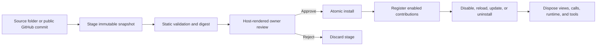

# Echo Plugin API v1

Echo plugins add deliberately bounded extensions around the core application. Chat, Trajectory, Code, Git, Settings, Terminal, workspaces, and existing tools remain immutable core features.

Plugin API v1 supports declarative page and floating views, model tools, host-rendered settings, secret references, namespaced storage, and an optional native JSON-RPC backend. A plugin installs once per Echo instance; global and workspace activation determine where it is effective, and only one version of an ID can be installed.

Start with:

- [Authoring](authoring.md) for package and manifest contracts.
- [`echo-plugin.schema.json`](echo-plugin.schema.json) for the published, editor-consumable API v1 manifest schema.
- [Security](security.md) for the trust model and approval boundary.
- [Backend protocol](protocol.md) for `echo-jsonrpc-1`.
- [UI bridge](ui-bridge.md) for sandboxed views.
- [Packaging](packaging.md) for local/GitHub distribution and CI.
- [Troubleshooting](troubleshooting.md) for validation, runtime, and recovery failures.

The [Calculator](../../internal/plugins/builtin/calculator/echo-plugin.json) is the first-party floating-UI example. The [developer showcase](../../examples/plugins/showcase/README.md) demonstrates a page, settings, secrets, backend RPC, events, and an agent tool.

## Lifecycle at a glance

Staging never executes package code. Approval is an authenticated UI action and cannot be performed by a model tool or imitated with chat Markdown.
